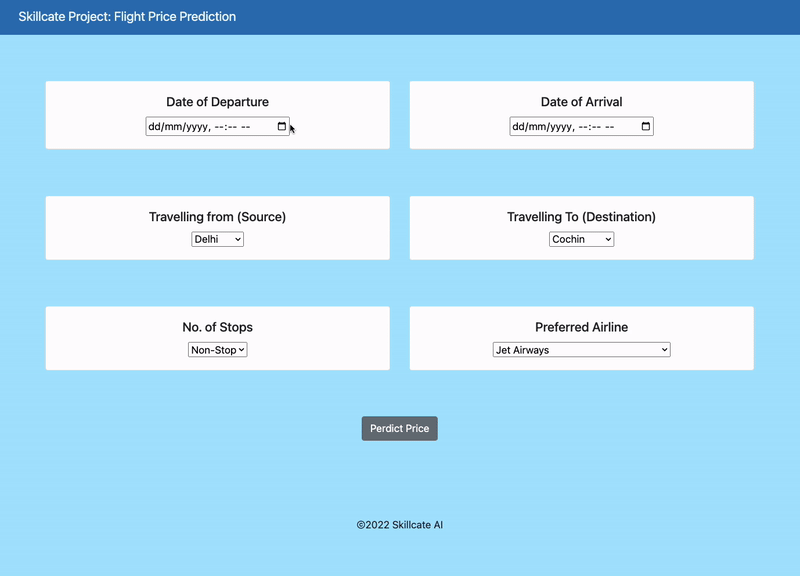

# Flight_Ticket_Price_Prediction
## Overview
* Flight fare prediction is a classical problem of time series forecasting that finds trends in past observations to outline the future
* Many popular flight booking websites today, including Google Flights, showcase important insights on:
  * Current fair status: high, low or fair
  * Past fare trends, upcoming future trends and 
  * Helps decide the right time to book a flight ticket.
## Features
User Input Form: A user-friendly form to input flight details such as date and time, airline, source, and destination.

Real-Time Prediction: The app provides an instant prediction of flight prices using a Random Forest model.

Pre-trained Model: The model is trained on historical flight data, and the predictions are made based on the most relevant features.

Responsive Design: The front end is developed using HTML and is designed to be simple and easy to use.

## Project Structure

"app.py" : The main Flask application script that handles routing, data processing, and model prediction.

"c1_flight_rf.pkl" : The pre-trained Random Forest model used for predicting flight prices.

"templates/home.html" : The HTML template that serves as the front end of the application, allowing users to input flight details and view the predicted price.

## App Functionality

## Steps to run Flight Fare App - on Windows

* Prerequisites: [Python 3.9](https://www.python.org/downloads/) (ensure Python is added to [PATH](https://medium.com/co-learning-lounge/how-to-download-install-python-on-windows-2021-44a707994013)) + [Git](https://git-scm.com/downloads) Client 
* Open GIT CMD >> navigate to working directory >> Clone this Github Repo (or download project files from GitHub directly)

      git clone https://github.com/skillcate/flight-price-prediction.git  
* Open Windows Powershell >> navigate to new working directory (cloned repo folder)
* Run Project in Flask (Using PIP + Virtualenv)
 
        pip install virtualenv                  # install virtual environment        
        virtualenv ENV                          # create virtual environment by the name ENV
        .\ENV\Scripts\activate                  # activate ENV
        pip install -r .\requirements.txt       # install project dependencies
        python app.py                           # run the project
        deactivate                              # close virtual environment once done
  

### Important links:

* [Dataset](https://www.kaggle.com/datasets/nikhilmittal/flight-fare-prediction-mh)
* [Project Folder on Drive](https://drive.google.com/drive/folders/1vnapi048bbmoXyoxOLLX6W_tA6a1uQ9w?usp=sharing)
